Solutions for IDA Pro
=====================
When opening a binary in IDA Pro, we get a dialog with some settings. In our examples, we can just load the binary with the standard-setting.

Exercise 1
----------

Since .so files are dynamic libraries, we check what functions are exported. Some of them are standard ones, so we may ignore it for this exercise.

### ex1_1.so
Not supported (64 bit binary)

### ex1_2.so

Exported functions:

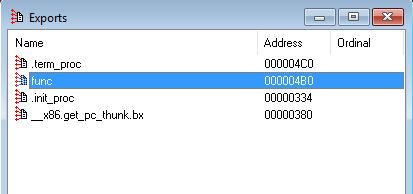

Functions in the binary:

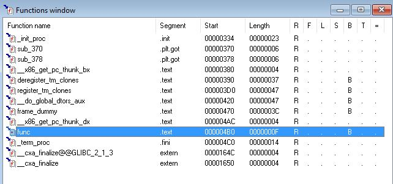

So it seems, that `func` is the function we are looking for. Let's view what happens in there:

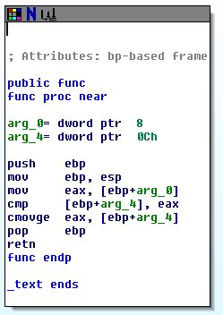


### ex1_3.so

Exported functions:

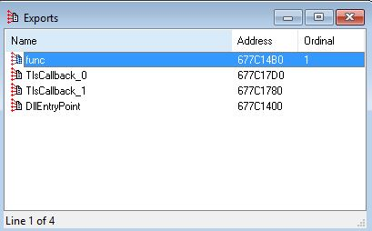

`func` disassembly:

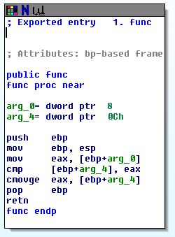


### ex1_4.so
Not supported (64 bit binary)


### Interpretation

If we look at the disassembled code, we see that they follow a similar structure:

1. base- and stack-pointer preparation
2. load a value into eax
3. compare eax with another value
4. conditional move (`cmovge` - Move if Greater Than or Equal to Zero)
5. restore base-pointer and return

A hint what is going on here are the [calling conventions](https://en.wikipedia.org/wiki/X86_calling_conventions) for the different binaries (only the relevant are listed):

Architecture | OS      | Parameters in registers              | Parameter order on stack
-------------|---------|--------------------------------------|-------------------------
IA-32        | linux   |                                      | right to left
IA-32        | windows |                                      | right to left

The return value is in the `eax` register.

Now we see that the 2 function-parameters from `int func(int, int)` are either on the stack or in registers (depending on the architecture/OS). Since the difference in the code is only the copying of these parameters on the stack and the logic afterwards is the same we may assume that the base-logic of these 4 functions is the same. 
When we now look at the 2 lines `mov eax, ...` and `cmp dword ...`, we see that this is a comparison between the 2 parameters of the function. When the value of the local value is greater then the one already in `eax`, the instruction `cmovge` puts this local value on `eax`, which is also the return value.

So basically, a C-like code of this function would look like:
```
int func(int a, int b)
{
	if(a > b)
	{
		a = b;
	}
	return a;
}
```

or shorter:

```
int func(int a, int b)
{
	return (a > b) ? a : b;
}
```


Exercise 2
----------
After loading the binary, we see that there is automatically a graph generated starting at the main-function:

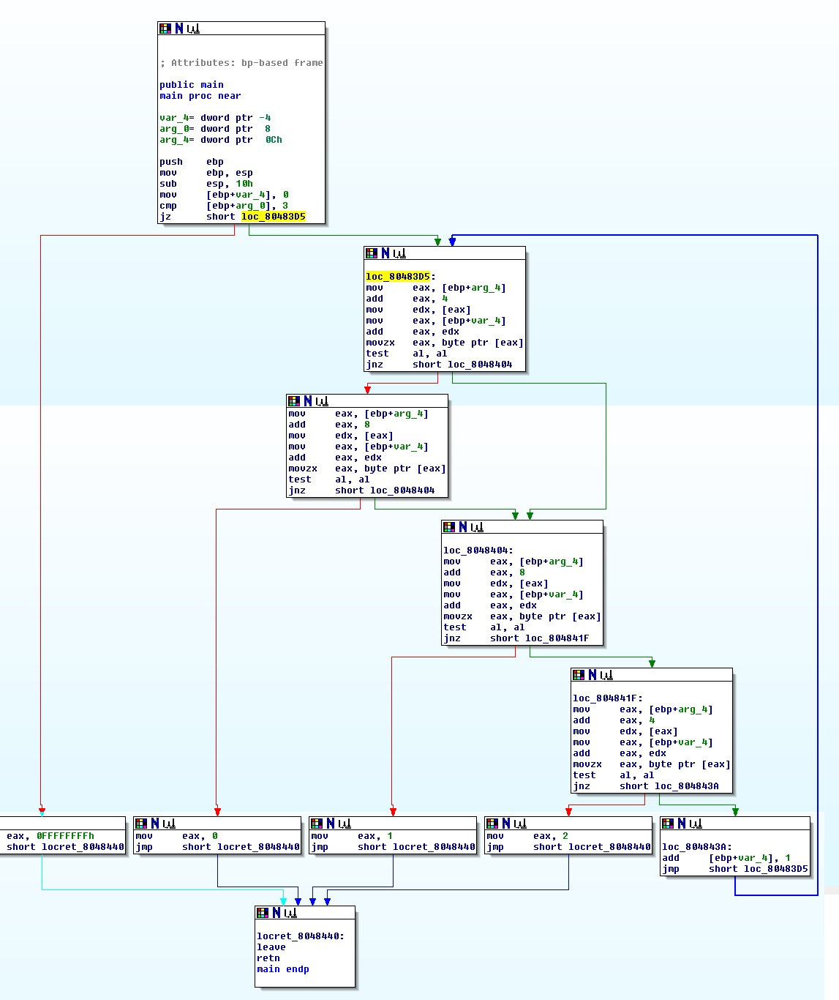

But just to be sure, that this is the only interesting part in the binary, we check the functions:

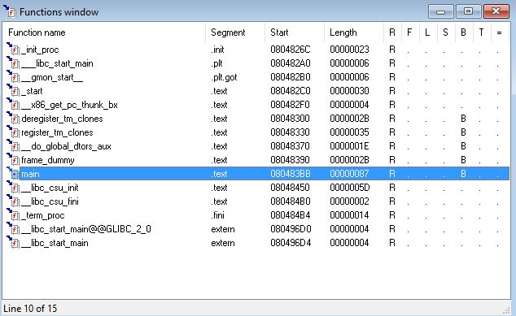

Ok, it really seems like that we only have to deal with the main-function here.

Now let's see what happens here, so first we take a look st the starting block. We know, that the program takes 2 strings as input. We also know, that the entry-point of C-programs is `int main(int argc, char* argv[])`, so by looking at the code, we can assume that the 2 arguments are `argc` and `argv`, and therefore we can rename them by right clicking and select 'rename' (or select the argument and press 'n')

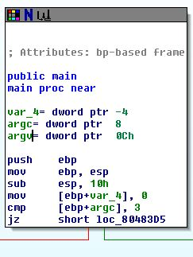

So at after dealing with stack- and base-pointer, there is a check, if there are exactly 3 parameters, and if not, we set `eax` to `-1` and exit the program.


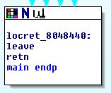

Now we take a look to the other blocks. There are 3 blocks which set the exit-code to 0, 1 and 2.


And we also have some sort of counter (`var_4`):


The interesting part lies in the 4 similar looking blocks:

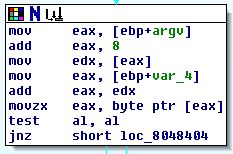

Which is equally to the c-code `if (argv[2][counter]==0)` or `argv[1][counter]==0` for some of the other similar blocks).

Using this we can step through the graph to rebuild a C-code:


```
int main(int argc, char* argv[])
{
	int counter = 0;
	if(argc == 3)
	{
start:
		if (argv[1][counter]==0)
		{
			if (argv[2][counter]==0)
			{
				return 0;
			}
			else
			{
				counter++;
				goto start;
			}
		}
		else
		{
			if (argv[2][counter]==0)
			{
				return 1;
			}
			else
			{
				if (argv[1][counter]==0)
				{
					return 2;
				}
				else
				{
					counter++;
					goto start;
				}
				
			}
		}

	}
	return -1;
}

```

after some cleaning-up we get:

```
int main(int argc, char* argv[])
{
	int counter = 0;
	if(argc == 3)
	{
		while(1)
		{
			if (argv[1][counter]==0)
			{
				if (argv[2][counter]==0)
				{
					return 0;
				}
			}
			else
			{
				if (argv[2][counter]==0)
				{
					return 1;
				}
				else
				{
					if (argv[1][counter]==0)
					{
						return 2;
					}
				}
			}
		}

	}
	return -1;
}

```

So this program returns which of the 2 given strings is smaller (or `0` if they are equally long) and `-1` when the wrong amount of arguments are provided.

Exercise 3
----------
Again, first we check the functions of this binary:

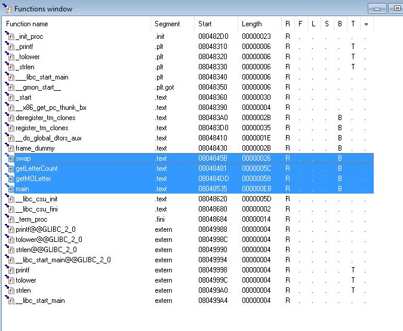

Well, here we have some new interesting sounding functions:
- `swap`
- `getLetterCount`
- `getMOLetter`

Next we take a look at the graph:

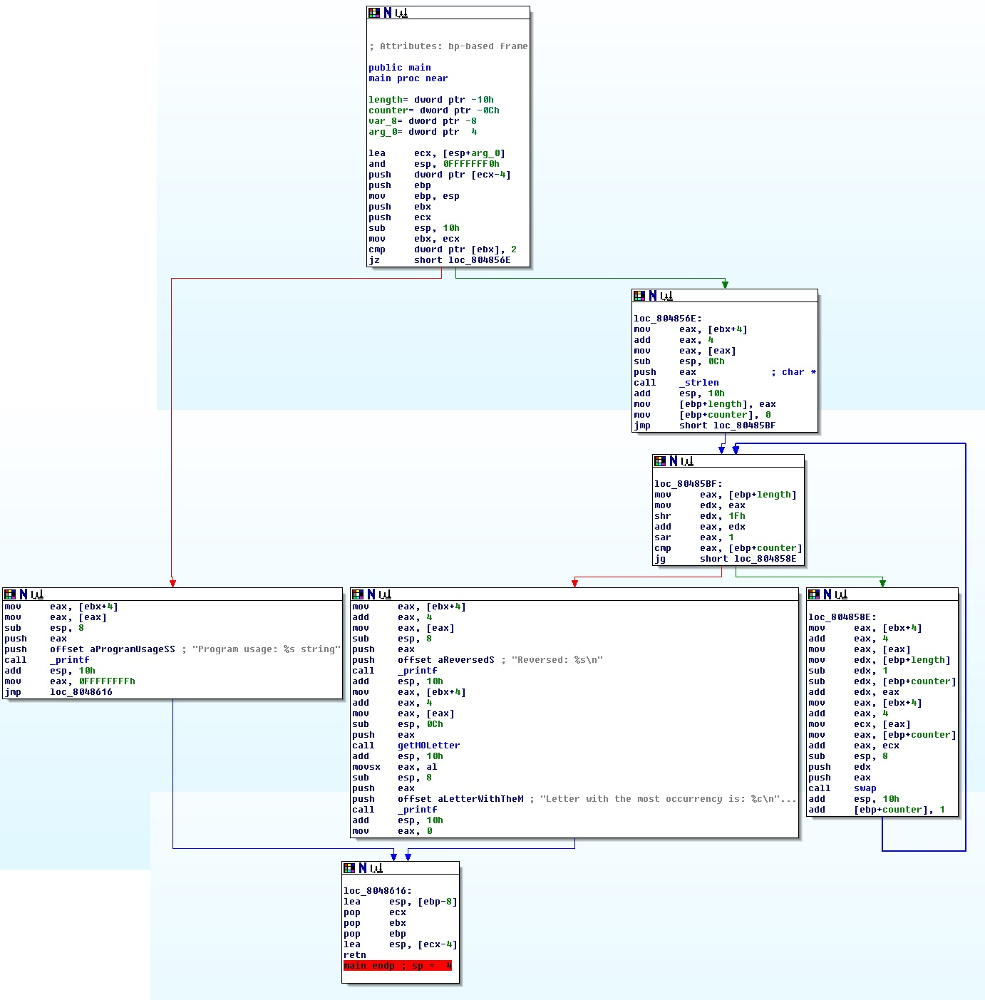

Now we have calls to additional functions, some of them are c-functions (`_printf` and `_strlen`) and some are in the same binary (`getMOLetter` and `swap`)

The strings of the `printf` function are giving us very good hints what is going on.
First, we have a help-text to display the correct usage of the program. Then we will display the text 'Reversed: ' followed by a string and then we will display the letter with the most occurrences.

Similar to the second exercise, we have some local variables, which we can try to figure out what their purpose is:
- `local_4` is set to the result of strlen, so it should be better named length
- `local_3` is initialized with 0, gets increased by 1, and gets compared with `length/2`, so that must be a counter of something like a for-loop
- `local_2` is not clear, but since it is at the clean-up part of the program, we can ignore it (seems to be used to save ecx, ebx and ebp to ebp-0x8, ebp-0x4, ebp)

We might also notice, that `ebx` is used quiet often, and is only set once in the beginning to the address of `argc`

Also, we have some code-blocks with
```
mov eax, dword [ebx + 4]
add eax, 4
mov register, dword [eax]
```
which is like `register = argv[1]`

So what is the main-function doing now?

- At the beginning, `argc` is compared with `2`, and if it fails, a help-text about the program usage is displayed and the program quits.
- Then, we initialize `length` with `strlen(argv[1])` and `counter` with `0`.
- Afterwards we jump to a comparison if `counter` is smaller than `length/2`, and if it succeed we call `swap` with `argv[1][counter]` and `argv[1][length-1-counter]`. From the function name, we can guess that the variables just get swapped in place, since we pass the addresses of the variables and not the value.
- When the loop is finished, we print `argv[1]`, which is now reversed.
- Next, `getMOLetter` is called and the result is displayed with the format-text `Letter with the most occurrency is: %c`. This may give us the conclusion, that `getMOLetter` is returning the character of the letter with the highest occurrence.

So, with this, the task of this exercise is completed. We could also analyze the functions itself, but it is not really necessary, because we already know what is going on. However, when we inspect some malware or binaries with some obfuscation, we would still hate to take a look inside of these content, because we can never be sure that the functions do what the name says.
