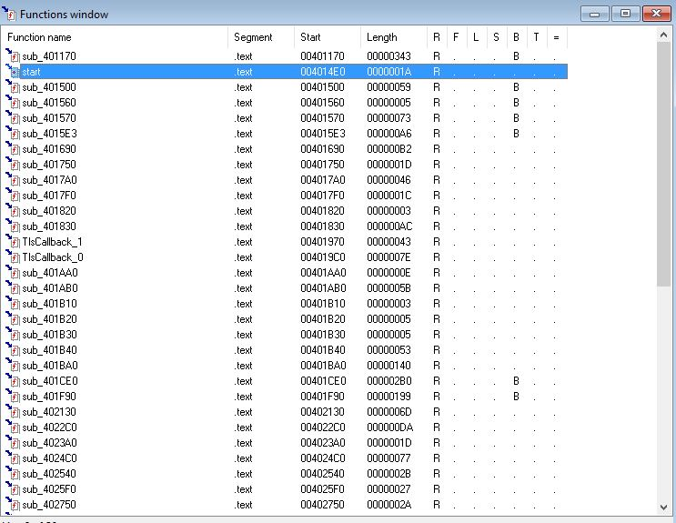
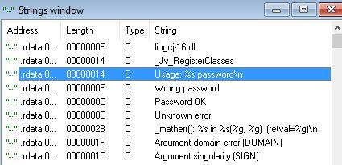
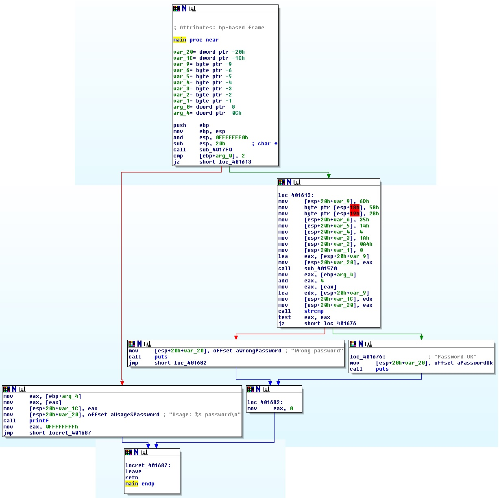
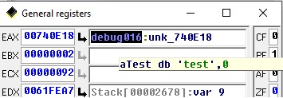
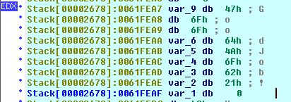
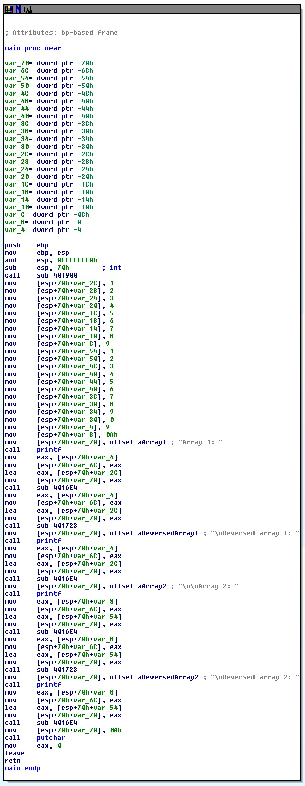
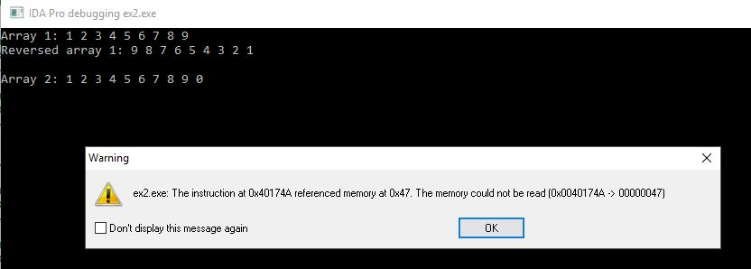
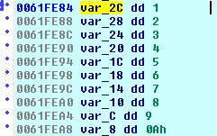
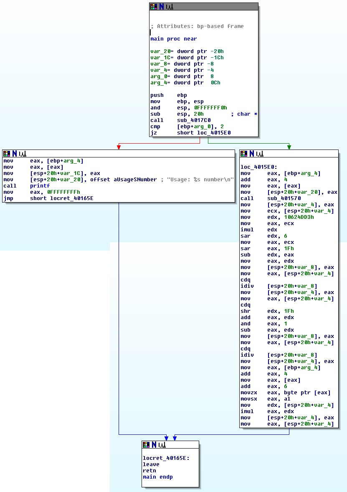
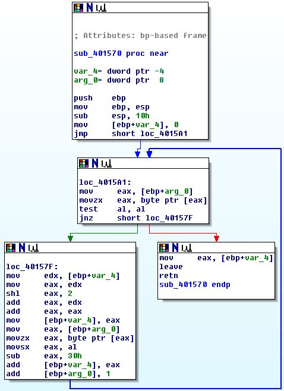

Solutions for IDA Pro
=====================

As we saw in the exercises for '2. Understanding Algorithms', finding out what a binary is doing can be very time-consuming and only guessing what a program does is also not the best way to analyze a binary. So we use a debugger in addition to the features of Radare2, we used before.

The debugger can be started with the menu or by pressing `F9`.


Exercise 1
----------

When we load the program in IDA Pro, we are shown the function `start`, but not the main-function which we want. When we look at the functions, we see that there are too many of them to go through, so we need another solution to find out where the interesting code is.



But we can help our self by simply starting the program in a command window. This gives us the following output:
`Usage: ex1 password`

This means that somewhere in our program this string must printed and this is also where the relevant logic lies. So we go to the 'Strings window' and search for 'Usage:' (You can use the search-function from the menu)



By double-clicking the string, we are taken to the `.rdata` section of this string.


Here we see the `XREF`, where the string is used. Again, we can double-click it to get taken to the code-section where it is used. This function looks very similar to a main-function of a c-program. Also there is a check at the beginning, if there are enough arguments given, and when there is a wrong amount the error-message is displayed and the program exits.



By looking at the graph, we see that we have a `strcmp` with a string, which was returned by another function, and the second argument of our input. Let' set a breakpoint at `strcmp` (right-click and 'set breakpoint' or `F2`) and take a look at the parameters.

To start the debugger with arguments for the program, we need to specify them in the 'Process options' (menu -> debugger). We just use 'test' as our password.

When starting the debugger, we hit a breakpoint right at the beginning. This was not the one we are looking for, so we just continue (`F9`) till the next breakpoint (which is now the one we defined)

Since we know that in the x86 calling conventions, the parameter for a function have to be put on the stack. By looking at the code, we see that we don't have to look at the stack for the string-pointers, because they are still in `edx` and `eax`.


So we check, what's the content of these strings:



`eax` is our string from the parameter, so `edx` points to the password. We can go to the stack-location, where `edx` points to by clicking at the small arrow left of `Stack[00002678]:var_9`


Well, this is currently not very useful, but we see that there is some 0-terminated array there. Let's remove the format of the data for the items (select, then right-click and use 'undefine' or `U`)



Now this looks like a usable string. Now we start the program again with this string as password.

```
ex1 GoodJob!
Password OK
```

Nice, so we solved exercise 1.

Exercise 2
----------
Like in exercise 1 we have to find the main-function. When looking at the program-output, se see that we can search for 'Array 1:'. This gives us following graph: (sub_401570)



So we have 2 arrays here and 2 variables for the lengths of the arrays (9 and 10).
Then is seems that the arrays and their reversed content are printed.

Now let's start the program and see what happens:



Ok, the first array is processed normally, but the second one crashed. Also the crash must occur while the reversing of the array.

The crash happens on address `0040174A` in the following function:
```
.text:00401723 ; ¦¦¦¦¦¦¦¦¦¦¦¦¦¦¦ S U B R O U T I N E ¦¦¦¦¦¦¦¦¦¦¦¦¦¦¦¦¦¦¦¦¦¦¦¦¦¦¦¦¦¦¦¦¦¦¦¦¦¦¦
.text:00401723
.text:00401723 ; Attributes: bp-based frame
.text:00401723
.text:00401723 sub_401723 proc near                    ; CODE XREF: main+E5p
.text:00401723                                         ; main+139p
.text:00401723
.text:00401723 var_C= dword ptr -0Ch
.text:00401723 var_8= dword ptr -8
.text:00401723 var_4= dword ptr -4
.text:00401723 arg_0= dword ptr  8
.text:00401723 arg_4= dword ptr  0Ch
.text:00401723
.text:00401723 push    ebp
.text:00401724 mov     ebp, esp
.text:00401726 sub     esp, 10h
.text:00401729 mov     [ebp+var_4], 0
.text:00401730 mov     eax, [ebp+arg_4]
.text:00401733 sub     eax, 1
.text:00401736 mov     [ebp+var_8], eax
.text:00401739 jmp     short loc_40178D
.text:0040173B ; ---------------------------------------------------------------------------
.text:0040173B
.text:0040173B loc_40173B:                             ; CODE XREF: sub_401723+70j
.text:0040173B mov     eax, [ebp+var_4]
.text:0040173E lea     edx, ds:0[eax*4]
.text:00401745 mov     eax, [ebp+arg_0]
.text:00401748 add     eax, edx
.text:0040174A mov     eax, [eax]
.text:0040174C mov     [ebp+var_C], eax
.text:0040174F mov     eax, [ebp+var_4]
.text:00401752 lea     edx, ds:0[eax*4]
.text:00401759 mov     eax, [ebp+arg_0]
.text:0040175C add     edx, eax
.text:0040175E mov     eax, [ebp+var_8]
.text:00401761 lea     ecx, ds:0[eax*4]
.text:00401768 mov     eax, [ebp+arg_0]
.text:0040176B add     eax, ecx
.text:0040176D mov     eax, [eax]
.text:0040176F mov     [edx], eax
.text:00401771 mov     eax, [ebp+var_8]
.text:00401774 lea     edx, ds:0[eax*4]
.text:0040177B mov     eax, [ebp+arg_0]
.text:0040177E add     edx, eax
.text:00401780 mov     eax, [ebp+var_C]
.text:00401783 mov     [edx], eax
.text:00401785 add     [ebp+var_4], 1
.text:00401789 sub     [ebp+var_8], 1
.text:0040178D
.text:0040178D loc_40178D:                             ; CODE XREF: sub_401723+16j
.text:0040178D mov     eax, [ebp+var_4]
.text:00401790 cmp     eax, [ebp+var_8]
.text:00401793 jnz     short loc_40173B
.text:00401795 nop
.text:00401796 leave
.text:00401797 retn
.text:00401797 sub_401723 endp
```
Let's find out how this function is working. Obviously, it is some sort of reverse algorithm and has 2 arguments and 3 local variables.

So we set a breakpoint at the start of the function (but after the ebp saving) and try to figure out what's in these arguments and variables.

Arguments on stack:


Pointer from `arg_0`:


This means that `arg_0` is the array and `arg_4` is the length of the array.

We also know that the function works with an array-length of 9, but not with 10. 
To figure out what happened, we must go a little deeper here. Let's take a look on the local variables:

- `var_4` - is initialized with `0` (`0x00401729`)
- `var_8` - is initialized with `length-1` (`0x00401730 - 0x00401736`)
- `var_C` - is used for some swapping of variables of the array, indexed by `var_4` and `var_8` (` 0x0040173B` - `0x00401783`)

We also see, that `var_4` and `var_8` are incremented/decremented and then there is a comparison if they are equal
(`0x00401785` - `0x00401789`).

And here we might have our problem, the conditional jump at `0x00401793` is a `jnz`, but this can cause problems, because this only works on odd lengths of arrays. We also can confirm this behavior with the data we have extracted above. To fix this, the `jnz` would have to be replaced by a `js`.


Exercise 3
----------
Again, finding the main-function is the first task here (hint: search for the string 'Usage:')



There is also a call to another function:



It seems that this function is to convert a string to a number. But without checking if the characters are really numbers.

Our plan to find the right input is to start the program with different input parameters and see where the exceptions occur and how we have to alter the input to get past the errors. We also check the values of the variables, when they are assigned.

Let's begin with `1234` as parameter:

`sub_401570` returns `0x000004d2`, which is `1234` in decimal. so the function works for the right input. The result is then stored in `var_4`

Next, there happens some 'magic' with bit-operators, which would be very painful to figure it out by our self. So we check, what is stored in the local-variables.

  Position | Variable |     Value
-----------|----------|-------------------
0x004015F0 | var_4    |  0x000004d2 (1234)
0x0040160D | var_8    |  0x00000001 (1)
0x0040161A | var_4    |  0x000004d2 (1234)
0x0040162D | var_8    |  0x00000000 (0)

crash at the division at `0x00401636`.

Now we start over again, but with another number. We try a larger one, because `var_8` gets derived from `var_4`, so we may guess, that there is perhaps a division there.

  Position | Variable |     Value
-----------|----------|-------------------
0x004015F0 | var_4    |  0x00003039 (12345)
0x0040160D | var_8    |  0x0000000C (12)
0x0040161A | var_4    |  0x00000404 (1028)
0x0040162D | var_8    |  0x00000000 (0)

  Position | Variable |     Value
-----------|----------|-------------------
0x004015F0 | var_4    |  0x0001e240 (123456)
0x0040160D | var_8    |  0x0000007B (123)
0x0040161A | var_4    |  0x000003eb (1003)
0x0040162D | var_8    |  0x00000001 (1)

wow, this was actually working! (return code 0), why?

We try to make some c-code (check the instructions to get some additional info beside the debug-output from the 3 different arguments):

```
var_4 = sub_401570(argv[1]);
var_8 = var_4/1000;
var_4 /= var_8;
var_8 = var_4%2;
```

Then we also have some block for loading a character of `argv[1]` and multiply it with `var_4`, which is then the return value.

```
var_4 *= argv[1][6];
```

So for the program to finish with return code 0 and without crashing, the number must have exactly 7 digits (so the first potential division-error is also handled with, because there the number must be > 1000), and the input/1000 also have to be an odd number. Interestingly, we could also input some other characters than numbers, and the program may also finish successfully :)